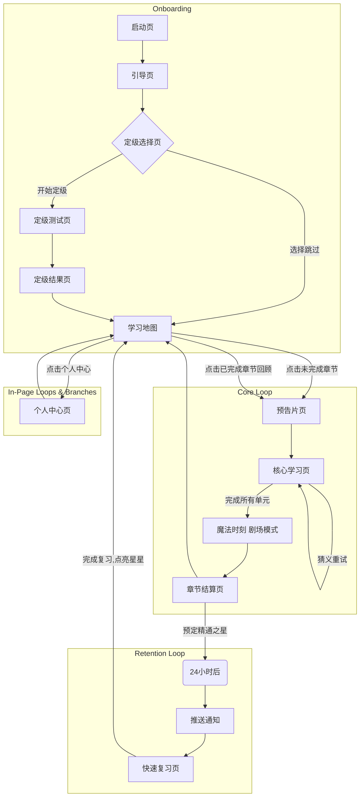

# **产品需求文档：JusTalk - MVP V1.0**

| 文档状态 | `定稿` |
| --- | --- |
| **项目代号** | JusTalk |
| **版本** | 1.0 |
| **创建日期** | 2024-06-14 |
| **创建人** | AIO-PM |
| **目标上线日期** | TBD |

## 1. 概述 (Overview)

### 1.1 项目背景
大量外语学习者在掌握了一定的基础词汇和语法后，会陷入“准会话学习者困境”：因缺乏安全、有效的练习环境和高质量的输入，而无法将知识转化为实际的听说能力。他们害怕犯错，缺乏自信，导致学习停滞不前。

### 1.2 产品愿景
JusTalk 旨在成为一个革命性的语言“习得”生态系统。我们不“教”语言，而是通过电影级的互动故事，让用户“经历”语言。我们的核心理念是：在低焦虑的沉浸式环境中，通过海量的“可理解性输入”先建立语感和听力直觉，再通过精准、鼓励性的“输出练习”将其固化为肌肉记忆，最终让用户自然而然地开口，自信地交流。

### 1.3 MVP 目标
*   **核心价值验证:** 验证“叙事沉浸 → 输入理解 → 输出巩固 → 成就闭环”这一核心学习循环的有效性和用户吸引力。
*   **用户行为指标 (北极星):**
    *   **新用户激活率 (完成首个故事章节):** ≥ 40%
    *   **核心留存抓手 (次日留存率):** ≥ 35% (由“预定之星”机制驱动)
*   **学习效果指标:**
    *   用户在核心学习循环中，首次尝试通过率 ≥ 70%。
    *   用户对“魔法时刻”（无字幕看懂视频）的正面反馈率 ≥ 80%。

---

## 2. 目标用户画像 (Target User Persona)

*   **姓名:** 小琳
*   **背景:** 28岁，在一家互联网公司做市场工作，喜欢看美剧和国外博主的视频。
*   **语言水平:** 大学英语六级，词汇量不错，能看懂大部分书面英文。但在实际交流中，听力反应慢，口语表达磕磕巴巴，常用单词也想不起来。
*   **痛点:**
    1.  **输入低效:** 看美剧必须依赖字幕，否则跟不上；感觉只是在“认字”，而不是在“听懂”。
    2.  **输出恐惧:** 害怕自己的发音不标准被人笑话，不敢在公开场合或与人交流时说英语。
    3.  **缺乏动力:** 使用过多种App，要么是枯燥的背单词，要么是毫无情景的AI对话，很快就因挫败感和无聊而放弃。
*   **核心渴望:** 能够像享受母语内容一样，无障碍地欣赏原声影视剧，并在与外国友人交流时，能自信、流畅地表达自己的想法。

---

## 3. 用户场景 (User Scenarios)

*   **场景一：首次接触与建立信任**
    小琳在通勤路上打开了JusTalk。一个简短的动画告诉她“我们不背单词，我们经历故事”。她完成了一个3分钟的快速定级，系统告诉她“你的基础很棒，推荐从‘咖啡馆奇遇’开始”。这让她感觉被理解，并对即将开始的故事充满期待。

*   **场景二：沉浸式学习与心流体验**
    晚上，小琳开始学习“咖啡馆奇遇”第一章。她首先观看了一段带字幕的预告片。接着，进入学习环节。系统播放了一句台词的音频，并给出三个动态视频片段让她选择。她通过观察人物的口型和动作，成功猜对了意思。然后，她模仿着说出这句台词。系统告诉她“很棒！”，并提供了一个可展开的“发音诊断报告”，她看到自己大部分单词都是绿色的，只有一个单词是红色的，她轻松地进行了修正。整个过程流畅、有趣，没有丝毫压力。

*   **场景三：“魔法时刻”与成就巅峰**
    小琳完成了本章所有核心句子的学习。屏幕上出现了“准备好，见证奇迹”的提示。随后，App全屏播放了本章故事的**无字幕版本**。令她惊喜的是，她竟然完全听懂了！每一个角色的对话都如此清晰。视频结束后，系统授予了她“体验之星”和“效率之星”，并告诉她第三颗“精通之星”已为她预定，明天回来复习即可点亮。她感到前所未有的成就感，并对明天的复习充满期待。

*   **场景四：习惯养成与长期留存**
    第二天午休，小琳收到了一个推送：“你的精通之星已准备好被点亮！”她打开App，用30秒完成了一个有趣的快速复习，第三颗星星“嘭”地一声被点亮。看着地图上那个闪耀着三颗星的章节，她迫不及待地点开了下一个全新的故事章节。

---

## 4. 功能需求详述 (Functional Requirements)

### 模块一：首次用户体验与引导 (First Contact & Onboarding)

#### 1.1 快速定级
*   **用户故事:** 作为一名新用户，我希望能快速让App了解我的水平，以便为我推荐最适合我的学习起点，让我感觉这是为我量身定制的。
*   **业务规则与逻辑:**
    1.  首次启动App的用户，在观看完方法论引导动画后，进入定级选择页。
    2.  用户可选择“开始3分钟定级”或“跳过，从新手开始”。
    3.  选择“跳过”的用户，系统默认其为`CEFR A1`级别。
    4.  定级测试包含2-3道“听音选图”题和2道“跟读句子”题。
    5.  系统根据用户的综合表现（选择正确率、发音得分），将其匹配到`CEFR A1, A2, B1`三个初始级别之一。
    6.  定级结果页会以可视化的方式（如雷达图）展示用户的能力评估，并给出鼓励性的学习建议。
*   **界面与交互:**
    *   测试过程指令清晰，交互简单，避免给用户带来压力。
    *   结果页需强化正面反馈，并提供一个明确的CTA按钮：“开启我的第一个故事”。

### 模块二：核心学习引擎 (The Core Learning Engine)

#### 2.1 叙事预告 (Narrative Trailer)
*   **用户故事:** 作为一名学习者，我希望在开始学习前，先了解整个故事的背景和目标，以便激发我的好奇心和学习动机。
*   **业务规则与逻辑:**
    1.  用户在学习地图页点击一个未开始的故事章节后，首先进入预告片页。
    2.  系统会播放一段30-60秒的、带目标语言和母语双语字幕的视频片段。
    3.  该片段是本章节学习完成后，用户将要挑战的“无字幕版”视频。
*   **界面与交互:**
    *   视频播放器支持暂停、播放。播放完毕后自动引导用户进入下一环节。

#### 2.2 情景猜义 (Contextual Immersion)
*   **用户故事:** 我希望通过观察情景来理解声音的含义，而不是依赖翻译，以便于我建立语言的直觉反应。
*   **业务规则与逻辑:**
    1.  每个学习单元（句子或短语）开始时，系统首先播放标准音频。
    2.  界面同时呈现3个循环播放的、无声的动态视频片段（GIF或短视频）。其中1个是正确匹配的，2个是来自同一故事的干扰项。
    3.  用户点击选择视频。
    4.  选择正确，获得正面音效和视觉反馈，进入下一个“跟读与润色”环节。
    5.  选择错误，该选项变灰并轻微抖动，提示用户重试。
    6.  **异常状态 - 专注模式 (Focus Mode):** 当用户在同一单元连续选择错误2次后，触发“专注模式”。
        *   界面会覆盖一个半透明浮层，提示“别担心，我们放慢点”。
        *   错误的两个选项进一步变暗，正确的选项会发光或高亮，引导用户做出正确选择。
*   **界面与交互:**
    *   视频片段需能清晰地传达动作或情绪，帮助用户猜测。
    *   “专注模式”的设计必须是鼓励性的，而非惩罚性的。

#### 2.3 跟读与润色 (Echo & Refine)
*   **用户故事:** 在我理解意思后，我希望能立刻模仿跟读，并得到精准、有建设性的反馈，告诉我哪里好，哪里可以更好，以便我能有效提升我的口语。
*   **业务规则与逻辑:**
    1.  完成情景猜义后，界面提示用户进行跟读。
    2.  用户按住录音按钮进行模仿。录音结束后，系统在1.5秒内调用语音评测API返回结果。
    3.  **反馈第一层 (宏观评价):** 系统首先给出一个总体的、鼓励性的评价。
        *   得分 ≥ 85分: 判定为“通过”。界面显示“完美！”或“太棒了！”等积极文案，并伴有奖励动画。
        *   得分 < 85分: 判定为“待改进”。界面显示具体分数（如“72分”），并附带一句简短的鼓励（如“很不错，再试一次会更好！”）。
    4.  **反馈第二层 (细节诊断 - 可选):** 在宏观评价下方，始终提供一个“查看发音诊断”的按钮。
        *   用户点击后，才会展开显示带有逐词颜色标记（如：绿色-优秀，黄色-良好，红色-待改进）的句子。这确保了用户在跟读时不受干扰，而在复盘时能获得细节。
    5.  **重试循环:** 得分“待改进”的用户可以重试。
    6.  **异常状态 - 救援模式 (Rescue Mode):** 当用户在同一单元连续3次跟读得分低于85分时，自动触发“救援模式”。
        *   系统会播放一段预置的、针对该句子难点的真人母语者“口型特写”慢动作教学视频。
        *   观看完救援视频后，用户进行最后一次跟读尝试。**无论本次得分如何，系统都将判定为“通过”**，以确保学习流程的顺畅，避免用户卡关。但通过“救援模式”的单元，在星级评定中可能会影响“效率之星”。
*   **界面与交互:**
    *   录音按钮状态需清晰：待机、录音中、分析中。
    *   “发音诊断报告”的展开/收起交互要流畅。
    *   “救援模式”的口型视频需高质量，能清晰展示发音口型。

### 模块三：成就闭环与激励系统 (Achievement & Motivation System)

#### 3.1 魔法时刻 (The Magic Moment)
*   **用户故事:** 当我完成一个章节的所有学习后，我希望能够立刻验证我的学习成果，体验到那种“我真的进步了”的巨大喜悦。
*   **业务规则与逻辑:**
    1.  当用户完成一个故事章节内所有的学习单元后，触发“魔法时刻”。
    2.  系统会先弹出一个充满仪式感的祝贺页面，文案如：“恭喜！准备好见证奇迹了吗？”
    3.  点击后，进入“剧场模式”，全屏、无任何UI干扰地播放本章节的**无字幕版**预告片。
    4.  播放结束后，弹出一个简单的自我反馈调查：“感觉怎么样？[🤯 完全听懂了！], [😲 听懂了大部分！], [🙂 还需要多练练]”。用户的选择仅用于数据分析和个性化鼓励。
*   **界面与交互:**
    *   “剧场模式”必须极简，营造沉浸感。
    *   自我反馈的选项设计要有趣、符合用户此刻的心情。

#### 3.2 三星评定系统 (Three-Star Rating System)
*   **用户故事:** 我希望我的努力能被量化和记录，并通过获得星星来获得持续的动力。
*   **业务规则与逻辑:**
    1.  在“魔法时刻”结束后，进入章节结算页面，进行星级评定。
    2.  **⭐ 第一颗星 (体验之星):** 只要用户**完成了**本章节所有的学习单元并观看了“魔法时刻”视频，即可100%获得。
        *   **奖励目标:** 鼓励完成度和坚持。
    3.  **⭐ 第二颗星 (效率之星):** 如果用户在本章节的学习过程中，触发“专注模式”和“救援模式”的总次数少于一个预设阈值（例如：3次），即可获得。
        *   **奖励目标:** 鼓励专注和高效的学习。
    4.  **⭐ 第三颗星 (精通之星 - 预定机制):**
        *   **获取资格:** 在结算页面，如果用户已获得前两颗星，第三颗星会自动进入“**已预定**”状态。
        *   **激活条件:** 用户必须在**24小时后**返回App，并完成一个与本章节内容相关的、时长约30-60秒的快速复习任务（如闪卡、听音辨意等）。
        *   **奖励目标:** 鼓励符合艾宾浩斯遗忘曲线的科学复习行为，是驱动次日留存的核心抓手。
*   **界面与交互:**
    *   **结算页面:**
        *   已获得的星星会以金色点亮。
        *   “已预定”的精通之星会以一种特殊状态显示（如灰色、被气泡包裹、有微弱的呼吸动画），并附有提示文案：“**精通之星已为你预定！明天回来复习即可点亮！**”
    *   **学习地图页:**
        *   完成的章节会显示获得的星级，包括特殊状态的“预定之星”。
    *   **复习与点亮:**
        *   次日，App会通过推送通知提醒用户。
        *   用户完成复习任务后，第三颗星会有一个华丽的点亮动画，并给予额外的虚拟奖励（如积分）。

---

## 5. 非功能性需求 (Non-Functional Requirements)

*   **性能:** 语音评测的API调用与返回总时长应控制在1.5秒以内。页面切换、视频加载应流畅无卡顿。
*   **兼容性:** MVP阶段优先适配主流的iOS和Android最新两个大版本的系统。
*   **数据与隐私:** 用户的语音数据仅用于发音分析，不应用于其他目的，需在隐私政策中明确说明。所有用户行为需进行埋点，以供数据分析和产品迭代。
*   **可访问性:** 需考虑颜色对比度，确保色弱用户也能分辨发音诊断中的颜色标记。

---

## 6. 待讨论事项 (Open Questions / TBD)

1.  **内容策略:** 每个故事章节包含多少个核心学习单元（句子/短语）为最佳体验？（初步建议：5-8个）
2.  **评测算法:** 语音评测API返回的多个维度（准确度、流利度、完整度）如何加权计算得出最终的85分阈值？需与技术团队深入探讨并实验。
3.  **复习任务设计:** “精通之星”的激活复习任务具体形式是什么？如何设计才能既有效又有趣，且耗时不超过1分钟？
4.  **激励体系:** 除了星星之外，是否需要引入更长期的激励体系，如积分、等级、徽章墙等？MVP阶段可暂缓，但需为后续扩展预留接口。

---

## 7. 图表 (Charts & Diagrams)

## **图一：业务流程图 (Business Process Flowchart)**

### **原理应用**
*   **第一性原理:** 业务流程的本质是**价值创造与传递**的过程。此图旨在剥离所有UI层面的细节，直击“我们如何系统性地将一个有学习需求的用户，转化为一个获得了真实能力提升、有高度成就感、并愿意长期留存的活跃用户”这一核心业务过程。它将清晰地展示价值是如何在用户与系统之间流动和转化的。
*   **金字塔原理:**
    *   **顶层结论:** 用户完成从“初识”到“激活”再到“留存”的完整价值闭环。
    *   **支撑论点:** 使用“用户”和“EchoVerse系统”两个泳道，清晰地划分了价值传递的双方。
    *   **具体论据:** 图中的每一个节点都代表一个具体的价值交换步骤（如用户付出“努力”，系统回报“反馈”），并穷尽了所有关键的分支与异常处理流程（如专注模式、救援模式），确保了业务逻辑的完整性和鲁棒性。

### **Mermaid 流程图**

```mermaid
graph TD
    subgraph 用户 (User)
        A1(启动App) --> A2{首次使用?}
        A2 -- 是 --> A3(体验方法论引导) --> A4{参与定级?}
        A4 -- 否, 跳过 --> A6(进入学习地图<br/>[默认A1级])
        A4 -- 是 --> A5(完成快速定级) --> A7(进入学习地图<br/>[个性化级别])
        A2 -- 否 --> A7

        A7 --> A8(选择故事章节) --> A9(观看带字幕预告片)
        A9 --> A10(进入核心学习循环)
        
        subgraph 核心学习循环 (Core Learning Loop)
            B1(听音并观察情景) --> B2{理解含义?}
            B2 -- 是 (选择正确) --> B3(跟读模仿)
            B2 -- 否 (选择错误) --> B1
            B3 --> B4{发音是否达标?}
            B4 -- 是 (得分≥85) --> B5(完成本单元学习)
            B4 -- 否 (得分<85) --> B3
        end

        A10 --> B1
        B5 -- 章节未完成 --> A10
        B5 -- 章节已完成 --> C1(进入“魔法时刻”)
        
        C1 --> C2(观看无字幕视频) --> C3(获得巨大成就感)
        C3 --> C4(进入结算页) --> C5(查看星级评定)
        C5 --> C6(返回学习地图)
    end

    subgraph EchoVerse系统 (System)
        S1(判断新老用户) --> S2(提供定级选项)
        S2 -- 用户跳过 --> S3(设置默认级别)
        S2 -- 用户参与 --> S4(执行定级测试并分析)
        S3 & S4 --> S5(呈现学习地图<br/>解锁对应章节)
        
        S5 --> S6(播放章节预告片)
        S6 --> S7(启动学习引擎)

        subgraph 核心引擎逻辑 (Engine Logic)
            E1(呈现情景猜义界面) --> E2{判断用户选择}
            E2 -- 错误 --> E2a{是否连续2次?}
            E2a -- 是 --> E2b(触发“专注模式”<br/>高亮正确项) --> E3
            E2a -- 否 --> E1
            E2 -- 正确 --> E3(呈现跟读界面)
            
            E3 --> E4(调用API评测发音)
            E4 -- 得分≥85 --> E5(判定通过, 给予即时奖励)
            E4 -- 得分<85 --> E4a{是否连续3次?}
            E4a -- 是 --> E4b(触发“救援模式”<br/>播口型视频<br/>本次强制通过) --> E5
            E4a -- 否 --> E3
        end

        S7 --> E1
        E5 -- 还有下一单元 --> S7
        E5 -- 本章所有单元完成 --> S8(触发“魔法时刻”流程)

        S8 --> S9(播放无字幕视频) --> S10(根据规则计算星级)
        S10 --> S11(授予“体验/效率之星”<br/>预定“精通之星”)
        S11 --> S12(更新学习地图状态<br/>解锁下一章节)
        S11 --> S13(将本章词句加入<br/>艾宾浩斯复习队列)
    end

    style B2 fill:#f9f,stroke:#333,stroke-width:2px
    style B4 fill:#f9f,stroke:#333,stroke-width:2px
    style C2 fill:#ccf,stroke:#333,stroke-width:4px
    style E2b fill:#ff9,stroke:#333,stroke-width:2px
    style E4b fill:#ff9,stroke:#333,stroke-width:2px
```

### **图解**
*   **核心闭环:** 图中清晰地展示了两个关键的微循环：**情景猜义循环** (B1-B2) 和 **跟读模仿循环** (B3-B4)，它们共同组成了宏观的**核心学习循环**。
*   **价值保护机制:** 系统泳道中的 **“专注模式” (E2b)** 和 **“救援模式” (E4b)** 是关键的异常处理逻辑，它们确保用户不会因卡关而流失，是产品“低焦虑”核心价值的体现。
*   **价值升华点:** **“魔法时刻” (C2)** 是整个业务流程的价值顶点，用户在此刻验证所有努力并获得巨大成就感。
*   **长期留存钩子:** 系统在流程的最后一步 **(S13)**，将学习内容加入复习队列，并与“精通之星”挂钩，为用户的长期留存埋下伏笔。

---

## **图二：信息结构图 (Information Architecture)**

### **原理应用**
*   **第一性原理:** 信息结构的本质是**产品内在逻辑的骨架**。EchoVerse的核心逻辑是“引导用户完成一段线性的、有叙事感的旅程”，而非提供一个“工具箱”。因此，其信息结构必须以用户的主干旅程为第一优先级，将其他支持性功能作为分支。
*   **金字塔原理:**
    *   **顶层结论:** EchoVerse App 的完整结构。
    *   **支撑论点:** 将整个App划分为四大模块：`主流程模块`（用户旅程的核心路径）、`支持模块`（提供辅助功能）、`浮层与特殊状态`（穷尽所有交互状态）、`底层数据与服务`（定义技术基础）。
    *   **具体论据:** 每个模块下都用层级缩进的方式，清晰地列出了所有页面、功能、信息元素及其归属关系。

### **Markdown 结构图**

```markdown
- **EchoVerse App**
    - **1. 主流程模块 (Main Flow Modules)**
        - 1.1. 启动与引导 (Launch & Onboarding)
            - 1.1.1. 闪屏页 (Splash Screen)
            - 1.1.2. 方法论引导页 (Methodology Intro)
            - 1.1.3. 定级选择页 (Assessment Choice)
        - 1.2. 快速定级 (Quick Assessment)
            - 1.2.1. 定级测试页 (Test Screen)
            - 1.2.2. 定级结果页 (Result Screen)
        - 1.3. 学习地图 (Learning Map) - **[核心枢纽]**
            - 1.3.1. 故事章节列表
                - 状态: 已锁定
                - 状态: 已解锁 (可开始)
                - 状态: 已完成 (显示星级)
        - 1.4. 故事章节体验 (Story Chapter Experience)
            - 1.4.1. 预告片页 (Trailer Page)
            - 1.4.2. 核心学习页 (Core Learning Screen)
            - 1.4.3. 剧场模式页 (Theater Mode for Magic Moment)
            - 1.4.4. 章节结算页 (Chapter Completion & Star Rating)
        - 1.5. 快速复习 (Quick Review)
            - 1.5.1. 复习任务页 (Review Task Screen)
    - **2. 支持模块 (Supporting Modules)**
        - 2.1. 个人中心 (Profile)
            - 2.1.1. 成就墙 (Achievement Wall - Badges, Stars)
            - 2.1.2. 学习统计 (Learning Statistics)
        - 2.2. 设置 (Settings)
    - **3. 浮层与特殊状态 (Overlays & Special States)**
        - 3.1. 专注模式浮层 (Focus Mode Overlay)
        - 3.2. 救援模式浮层 (Rescue Mode Overlay)
        - 3.3. 发音诊断报告 (Pronunciation Report - Expandable Area)
    - **4. 底层数据与服务 (Underlying Data & Services)**
        - 4.1. 用户模型 (User Model)
        - 4.2. 内容库 (Content Library)
        - 4.3. 语音评测API (Speech Recognition API)
        - 4.4. 艾宾浩斯复习引擎 (Spaced Repetition Engine)
```

### **图解**
*   **旅程导向:** 结构图的第一部分（主流程模块）完整地描绘了用户从A到B的线性路径，体现了产品的核心设计哲学。
*   **状态穷尽:** “浮层与特殊状态”被单独列出，确保了这些对用户体验至关重要的、非标准页面的交互状态不会在设计和开发中被遗漏。
*   **前后端分离思想:** “底层数据与服务”清晰地定义了产品的后端依赖和数据模型，有助于指导技术架构设计。

---

## **图三：页面流转图 (Page Flow Diagram)**

### **原理应用**
*   **第一性原理:** 页面流转的本质是**用户为完成特定任务而在产品中行进的路径**。此图聚焦于MVP最核心的任务——“新用户成功完成第一个故事章节并被激励再次返回”，描绘了完成该任务的所有主要路径和关键分支。
*   **金字塔原理:**
    *   **顶层结论:** 用户完成核心任务的导航路径。
    *   **支撑论点:** 以“快乐路径”（Happy Path）为主干，清晰展示了用户不受阻碍时的理想流程。
    *   **具体论据:** 通过分支和循环，详细描绘了各种选择（如跳过定级）、循环（如跟读重试）、以及最终导向留存（复习流程）的完整路径网络。

### **Mermaid 流程图**


### **图解**
*   **三大循环:** 此图清晰地展示了产品的三个关键循环：
    1.  **Onboarding:** 将新用户转化为合格学习者的引导流程。
    2.  **Core Loop:** 用户进行学习并获得即时成就感的核心体验闭环。
    3.  **Retention Loop:** 通过“预定之星”和复习机制，将短期成就感转化为长期回访行为的留存闭环。
*   **枢纽地位:** “学习地图 (E)” 在图中处于中心枢纽位置，所有流程都始于此或回归于此，其重要性不言而喻。

---

## **清单四：页面元素清单 (Page & Element Inventory)**

### **原理应用**
*   **第一性原理:** 任何复杂UI界面的本质，都是由**基础元素及其在不同情境下的状态**组合而成。此清单将产品UI拆解为这些最基本的“原子”单元，确保了设计与开发团队对每一个交互细节都有统一、明确的认知。
*   **金字塔原理:**
    *   **顶层结论:** MVP需要设计的所有关键页面。
    *   **支撑论点:** 每个页面下包含的核心元素列表。
    *   **具体论据:** 对每个元素，都详细定义了其规格、要求、以及所有可能的状态与交互方式，做到了 MECE (相互独立，完全穷尽)。

### **Markdown 表格清单**

### **页面一：学习地图 (Learning Map)**
| 元素 (Element) | 规格与要求 (Specification & Requirements) | 状态与交互 (States & Interactions) |
| :--- | :--- | :--- |
| **故事章节节点** | 以路径化的方式展示所有故事章节。<br>每个节点包含章节标题和星级展示区。 | **必须包含3种核心状态：**<br>1. **锁定 (Locked):** 灰色，带锁图标，不可点击。<br>2. **解锁 (Unlocked):** 主题色高亮，提示为当前应学章节，可点击。<br>3. **已完成 (Completed):** 显示获得的星级（金色/预定状态），可点击回顾。 |

### **页面二：核心学习页 (Core Learning Screen)**
| 元素 (Element) | 规格与要求 (Specification & Requirements) | 状态与交互 (States & Interactions) |
| :--- | :--- | :--- |
| **情景选项** | 3个并排的动态视频/GIF片段，无声循环播放。 | 1. **默认:** 正常显示。<br>2. **选中正确:** 放大、出现绿色边框或“✔”图标。<br>3. **选中错误:** 变灰、轻微抖动。<br>4. **专注模式下:** 错误项变暗，正确项高亮发光。 |
| **录音控制器** | 一个显眼的麦克风图标按钮，文案清晰。 | **必须包含3种状态：**<br>1. **待机:** "按住跟读"。 <br>2. **录音中:** 按钮变化，显示声波动画，文案变为“松开结束”。<br>3. **分析中:** 按钮禁用，显示加载动画，文案变为“分析中...”。 |
| **发音诊断报告** | 默认收起，仅显示宏观评价（如分数或“完美！”）。<br>包含一个可点击的“查看详情”按钮。 | 1. **收起状态:** 仅展示宏观评价。<br>2. **展开状态 (点击后):** 展示逐词带颜色标记的句子文本 (绿/黄/红)。 |
| **救援模式入口** | 默认隐藏。仅在连续3次跟读失败后出现。 | 出现后，点击可触发播放口型教学视频的浮层。 |

### **页面三：章节结算页 (Chapter Completion & Star Rating)**
| 元素 (Element) | 规格与要求 (Specification & Requirements) | 状态与交互 (States & Interactions) |
| :--- | :--- | :--- |
| **星级展示区** | 页面核心位置，用于展示本章获得的三颗星。 | **必须包含3种星星状态：**<br>1. **已获得 (Achieved):** 金色，高亮，有闪耀动画效果。<br>2. **已预定 (Booked):** 特殊视觉（如灰色但有呼吸光晕），明确传达“待激活”感。<br>3. **未获得 (Unearned):** 完全置灰或为空心轮廓。 |
| **文案提示区** | 位于星级展示区下方，用于解释星级状态。 | 根据获得的星级数量和状态，动态显示不同文案。<br>例如：“太棒了！精通之星已为你预定，明天回来点亮它吧！” |
| **CTA按钮** | 一个清晰的主要操作按钮。 | 文案：“返回地图” 或 “开启下一章”（如果适用）。 |

### **图解**
*   **设计与开发之桥:** 此清单是产品需求（PRD）与UI/UX设计、前端开发的直接桥梁，它将模糊的需求转化为具体、可执行的设计与开发任务。
*   **细节是魔鬼:** 对状态的穷尽，尤其是星星的3种状态和录音按钮的3种状态，能有效避免在开发过程中出现逻辑遗漏，保证最终产品的体验质量。